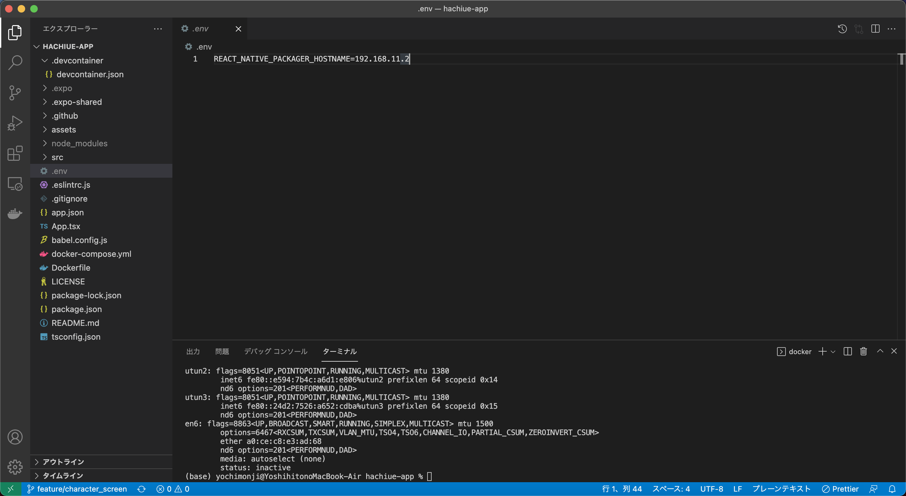
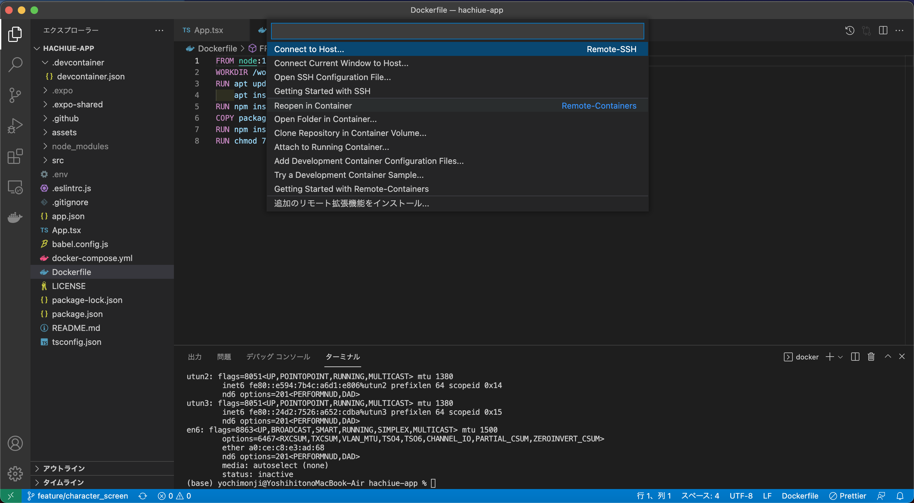
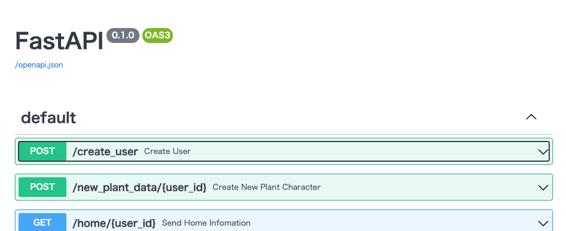
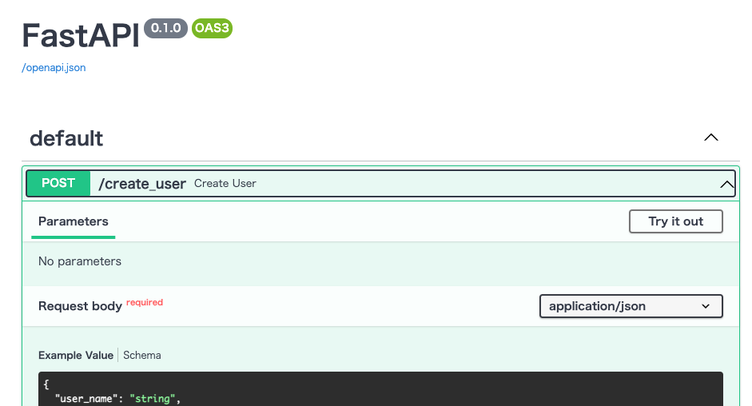
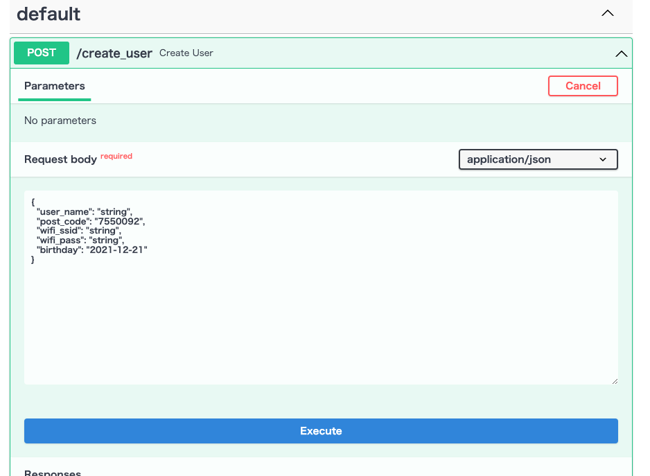
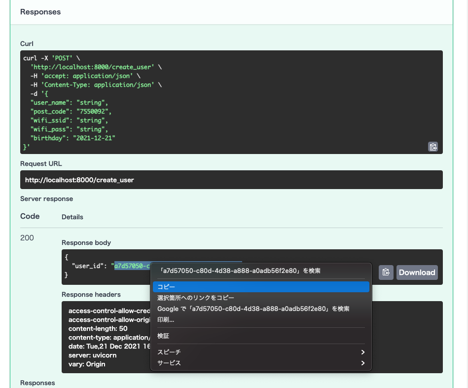
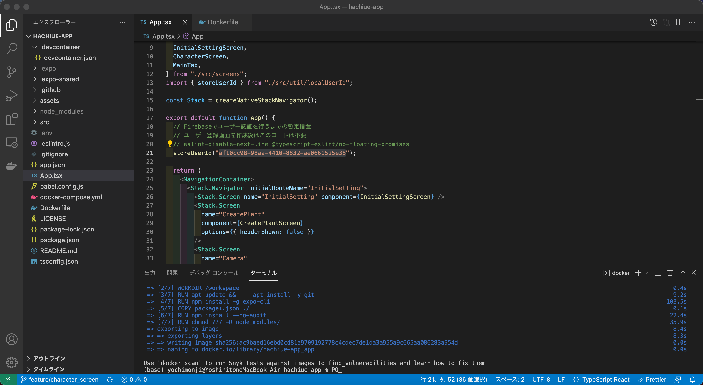
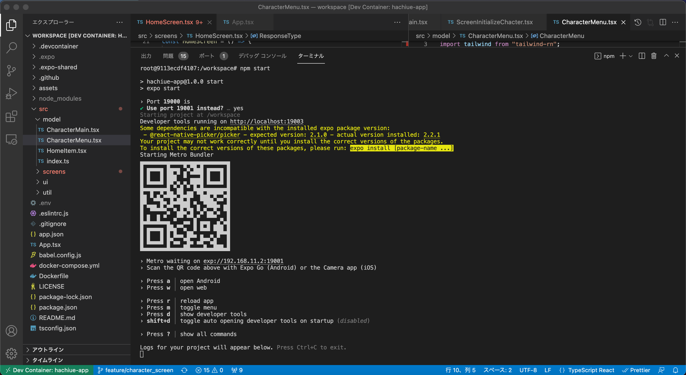
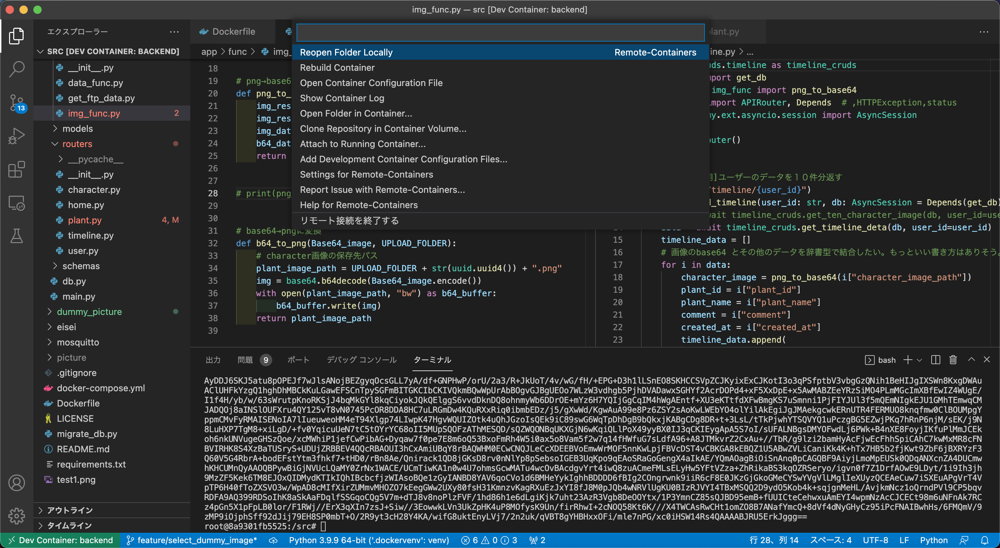

# Docker 環境構築方法

Docker を用いて開発環境を構築する方法について書かれたドキュメントです。VSCode の GUI の操作方法のみ記載しています。

## 初めに

本アプリ「HACHIUE」は[スマホアプリ](https://github.com/plant-management/hachiue-docs)と[バックエンド](https://github.com/plant-management/hachiue-backend)の2つのリポジトリに分けて構成されています。そのため、スマホ側とバックエンド側の両方をCloneし、Dockerを起動する必要があります。  
### 開発は後述のVSCodeのRemote Container機能を用いてコンテナ内で行ってください。

## 準備

始めにDockerとリポジトリの準備を行います。

1. Dockerの準備を行います。
   1. `docker`コマンドと`docker-compose`コマンドが動くようにします。Dockerの[公式サイト](https://docs.docker.com/get-docker/)などを見ながらインストールしたください。
   2. VSCode の拡張機能の Remote - Containers (または Remote Development) と Docker(← 拡張機能名です)をインストールします。VSCodeの左タブのExtentions（拡張機能）からそれぞれ検索してインストールしましょう。
2. 任意のフォルダに移動後、下記コマンドで2つのリポジトリをクローンします。  
   - Mac or Linuxの場合
    ```
    git clone https://github.com/plant-management/hachiue-app.git
    git clone https://github.com/plant-management/hachiue-backend.git
    ```
   - Windowsの場合
    ```
    git clone --config core.autocrlf=false https://github.com/plant-management/hachiue-app.git
    git clone --config core.autocrlf=false https://github.com/plant-management/hachiue-backend.git
3. 動作確認に必要な.envファイルを準備します。
   1. スマホで動作確認する場合に必要な設定です。スマホで動作確認する場合、**スマホとPCを同じネットワーク（ルータ）へ接続**することが必須です。学校でできるかは確認していないため、自宅で作業することを推奨します。
   2. パソコンのIPv4アドレスを調べます。
   3. 以下の画像のようにhachiue-appのルートディレクトリに.envフォルダを作成し、`REACT_NATIVE_PACKAGER_HOSTNAME=***.***.***.***`のように記述します。***は2で調べたIPアドレスです。
   


## Build & アプリ起動方法

Docker環境をbuildしてスマホの「Expo Go」というアプリを起動するまでの説明です。クローン仕立てを想定しています。**スマホとバックエンドどちらも同じ手順で実行してください。**

1. 左下の緑色の「><」をクリックし、続いて出てきたウインドウの「Reopen Container」をクリックしてしばらく待ちます。（場合によっては数分間かかります）スマホ側とバックエンド側両方します。
   - スマホに「Expo Go」をインストールしていない場合、build中にインストールしときましょう。Expo GoはExpoで作った本アプリをスマホ上で動作確認するためのアプリです。
   
2. hachiue-backendのコンテナ上でターミナルを開き、`python -m migrate_db`コマンドでデータベースを初期化します。
3. ユーザー作成機能が未実装のため以下の操作をお願いします。ユーザー作成機能実装後にアナウンスします。
   1. ブラウザで http://localhost:8000/docs にアクセスし、一番上の「POST /create_user Create User」→「Try it out」→「Execute」の順にクリックします。
   
   
   
   1. 下にスクロールするとResponse bodyの部分にuser_idがあるのでコピーします。
      - 時々Internal Server Errorと表示されることがありますが、Executeを連打しましょう。
   
   1. コピーしたuser_idをhachiue-app/App.tsxの21行目にペーストします。
   
4. hachiue-appのターミナルを開いて`npm start`コマンドを実行します。途中で`Use port 19001 instead?`と聞かれることがありますが、`y`と入力してください。表示されたQRコードをスマホのカメラアプリで読み取るとExpo Go上でアプリが起動し、動作確認できます。
   

## コンテナのRebuild方法

パッケージ・ライブラリを追加したリポジトリがマージされた場合や何らかの不具合が起きた場合にContainerをRebuildして作り直す方法です。**パッケージやライブラリを追加した場合はチームメイトはRebuildが必要になるのでみんなにアナウンスお願いします。**

1. コンテナ内にいる場合、左下の緑色の「Dev Container: ~~~」をクリックします。  
   
2. ターミナルに下記コマンドを入力し、キャッシュを使わずに構築しなおします([参考記事](https://qiita.com/tegnike/items/bcdcee0320e11a928d46#build))。  
   ```docker-compose build --no-cache```
3. [Build & アプリ起動方法](#build--アプリ起動方法)を1からやり直します。以上。